# 🛰️ SwiftMeshRelay – Check24 GenDev Hackathon [Winning]

> **Swift-native mesh messaging for iOS** – zero infrastructure, end-to-end encrypted, opportunistic multi-hop routing.

## Overview

SwiftMeshRelay lets iOS devices chat directly—no SIM, Wi‑Fi, or router required. Public keys are exchanged via QR, after which **MultipeerConnectivity** (MPC) forms an ad‑hoc wireless mesh. Messages travel hop‑by‑hop, wrapped in a minimal protocol and individually **ChaCha20‑Poly1305** protected.
> **Why it matters:** Disaster zones, festivals, classrooms, or field work often lack reliable connectivity. SwiftMeshRelay shows that Apple‑only frameworks can provide censorship‑resistant, privacy‑preserving communication—even offline.

## High-Level Architecture


* **UI Layer** – `MeshDebugView` provides an interface for testing, but any UI can be integrated.
* **Core Logic** – `MeshService` handles identity, encryption, routing, MPC sessions, and persistence.
* **Storage** – SwiftData keeps undelivered messages (`FrameEntity`) and contact info (`MeshContact`).
* **Transport** – Apple’s MultipeerConnectivity provides encrypted discovery and session transport over BLE/Wi-Fi.

## Identity & Onboarding

| Concept         | Data Structure               | Description                                                   |
| --------------- | ---------------------------- | ------------------------------------------------------------- |
| **ContactCard** | `uuid`, `nickname`, `pubKey` | Public-facing identity, exported via QR (Base64-encoded JSON) |
| **MeshContact** | SwiftData model              | Stores known contacts and public keys                         |

```text
┌─────────────┐        scan/share         ┌─────────────┐
│   My QR     │  ───────────────────▶     │  Your App   │
└─────────────┘                           └─────────────┘
```

* UUID is derived from the first 16 bytes of the SHA-256 hash of the public key.
* The keypair is stored securely in the Keychain under the tag `eqmesh.identity`.

## Custom Wire Protocol

Each packet after MPC encryption follows a consistent, minimal header layout:

```
<u8 type> <u16 BE headerLen> <header …> <payload …?>
```

| Type       | Code         | Header Payload                                | Notes                |
| ---------- | ------------ | --------------------------------------------- | ---------------------|
| **Frame**  | `0x46 ("F")` | `FrameHeader` (origin, dest, ttl, seq)        | Data + Metadata      |
| **Ack**    | `0x61 ("a")` | 8-byte frame identifier                       | Confirms delivery    |
| **Beacon** | `0x42 ("B")` | `Beacon` (origin, seq, ttl, hop) *(disabled)* | Routing optimization |

### Frame Header

```swift
struct FrameHeader: Codable {
    var origin: UUID    // sender
    var dest:   UUID    // final recipient
    var ttl:    UInt8   // hop budget (0–255)
    var seq:    UInt64  // timestamp‑derived sequence
}
```

### Frame Lifecycle (Store-and-Forward)


* Outbound messages become `FrameEntity` records.
* TTL decrements per hop; frames expire and are deleted locally when TTL hits 0.

> [!NOTE]  
> Due to the hackathon brevity, the acknowledgement cleanup has not been fully implemented. 

### Routing & Beacons

Beacons help establish `bestNextHop` entries:

* Every 2 seconds, a node broadcasts a beacon with `seqNo`.
* Peers remember latest `seqNo` per origin and prefer the shortest path.
* In current builds, flooding ensures delivery in small topologies.

> [!NOTE]  
> Due to the hackathon brevity, the beaconing and `bestNextHop` calculation has not been fully implemented.

## Encryption & Key Agreement

Each message is individually encrypted for its destination:

```
plaintext → ChaCha20‑Poly1305(seal) → cipherBlob → Frame → MPC → air
```

1. Perform **X25519** key exchange.
2. Derive symmetric key via **HKDF-SHA256**.
3. Encrypt using **ChaCha20-Poly1305** AEAD.

> 🔐 Only the destination peer can decrypt. Hops only forward opaque ciphertext.

## Sequence Diagrams

### Sending a Message

```mermaid
sequenceDiagram
    participant UI as MeshDebugView
    participant Mesh as MeshService
    participant Crypto as Crypto (ChaCha20‑Poly1305)
    participant Storage as SwiftData
    participant MPC as MCSession
    participant Hop as Next Hop
    participant Dest as Destination Mesh

    UI->>Mesh: sendMessage("Hi", destUUID)
    Mesh->>Crypto: deriveSymmetricKey(destUUID)
    Crypto-->>Mesh: SymmetricKey
    Mesh->>Crypto: seal(plaintext)
    Crypto-->>Mesh: cipherBlob
    Mesh->>Storage: insert FrameEntity {ttl=8, cipherBlob}
    Mesh->>Mesh: flush()
    Mesh->>MPC: build Packet(FrameHeader, cipherBlob)
    MPC->>Hop: send(Packet)
    Hop->>Dest: relay Packet (ttl‒1)
    Dest->>Dest: decrypt(cipherBlob)
    Dest-->>Hop: Ack(frameID)
    Hop-->>MPC: relay Ack(frameID)
    MPC-->>Mesh: Ack(frameID)
    Mesh->>Storage: mark delivered & delete FrameEntity
    Mesh-->>UI: publish lastInbound
```



### Three-Hop Delivery

```mermaid
sequenceDiagram
    participant A as Alice
    participant R1 as Router‑1
    participant R2 as Router‑2
    participant B as Bob

    A->>R1: Frame (ttl=3)
    R1->>R2: Frame (ttl=2)
    R2->>B:  Frame (ttl=1)
    B-->>R2: Ack
    R2-->>R1: Ack (relay)
    R1-->>A: Ack
```


### Contact Exchange via QR Code

```mermaid
sequenceDiagram
    participant A as Alice
    participant B as Bob

    A->>A: encode(ContactCard) → QR
    A->>B: scan QR
    B->>B: QR → decode(ContactCard)
    B->>B: insert MeshContact
```



## Persistence Model

```text
MeshContact 1───* FrameEntity
       │              │
       │              └─ cipherBlob (encrypted payload)
       └─ pubKey
```

* Messages persist through app restarts.
* Persisted frames survive crashes and airplane‑mode toggles.
* `flush()` runs on timer and when connectivity changes.
* Acknowledged messages are removed.

## Running the Demo

```bash
# 1. Clone
$ git clone https://github.com/check24/SwiftMeshRelay.git
$ cd SwiftMeshRelay

# 2. Open workspace
$ open SwiftMeshRelay.xcodeproj

# 3. Select a provisioning profile (if needed) and run on device
```

* Grant Local Network & Camera access when prompted.
* Install on **atleast two iOS devices** (simulators do not support BLE).
* Use the **QR icon** to show your contact card.
* Use the **Camera icon** to scan and add peers.
* Tap a **contact** and send a message.

> [!TIP]
> The UI shows the neigboor count. Try to position the devices in a chain, such that the endpoints don't detect each other.

## Limitations & Future Improvements

* 🌐 **Beaconing** – Re-enable and improve for efficient routing.
* 📨 **Ack Cleanup** – Fully clear delivered frames on both ends.
* 🔋 **Battery Optimizations** – Use adaptive beaconing based on activity.

## License

This project is open source and available under the MIT License.
